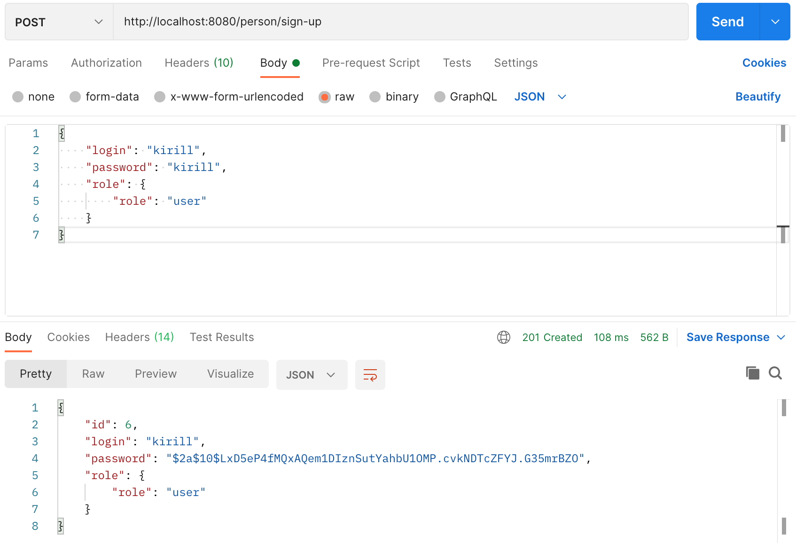
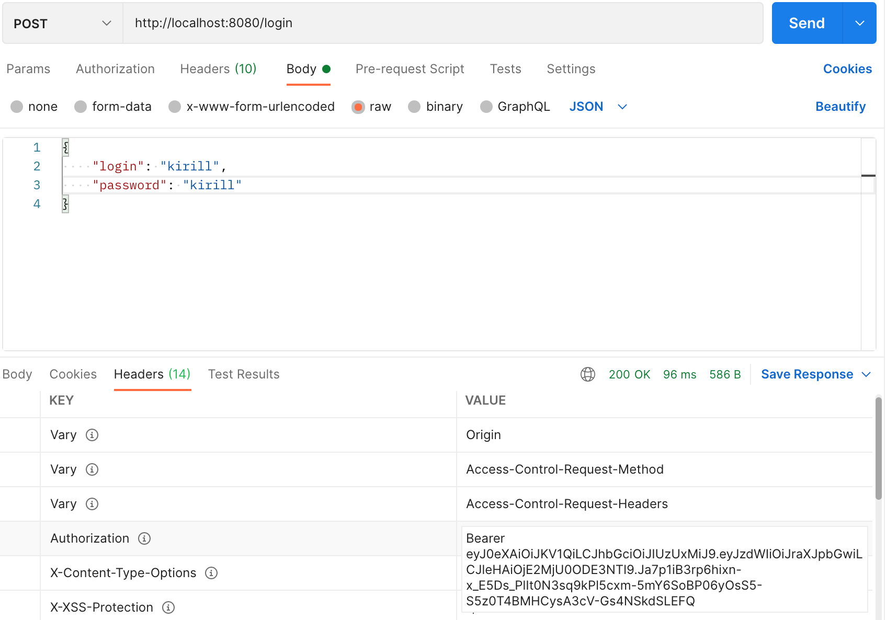
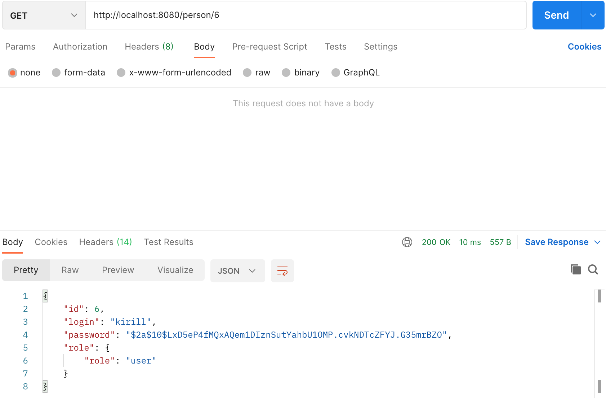
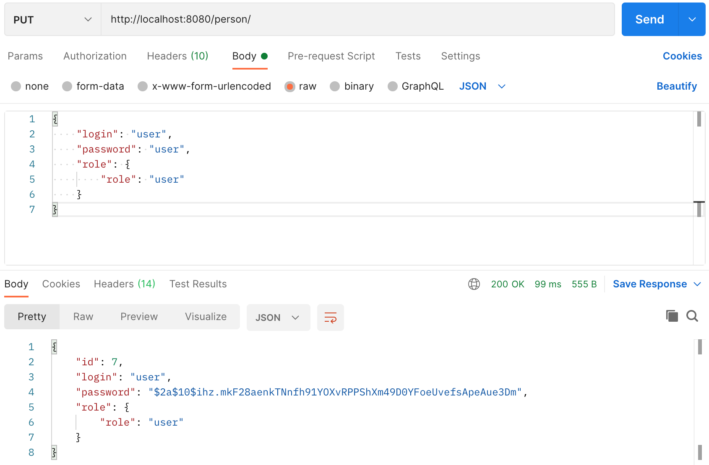
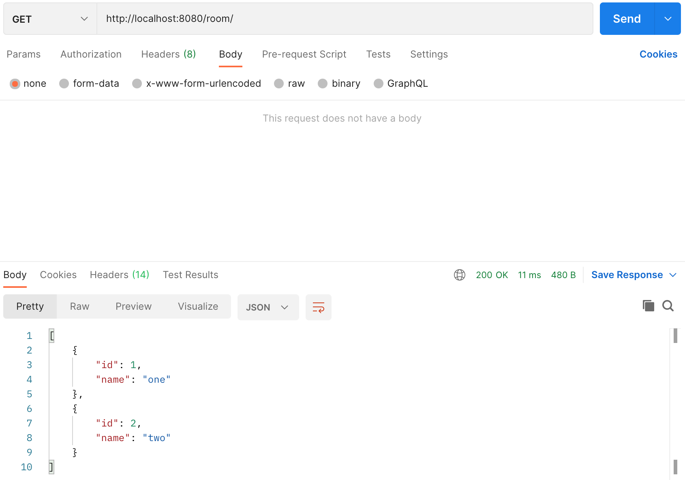
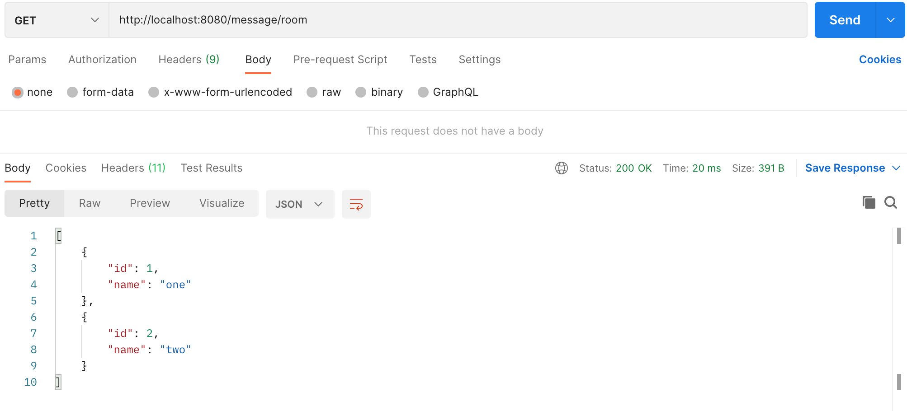
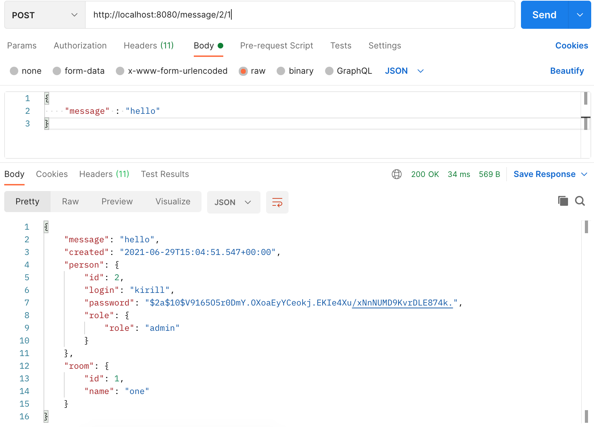

[](https://travis-ci.com/KirillBelyaev74/job4j_chat)
[](https://codecov.io/gh/KirillBelyaev74/job4j_chat)

## Проект курса [job4j](http://job4j.ru)

### Чат

Приложение риализует чат в комнатах. 
Можно создавать/редактировать/удалять модели Person и Room.

Технологии:
- PostgresSQL
- CRUDRepository
- Spring Boot / Security / Data / Rest
- Log4j
- JUnit / Mockito
- MVC / Singleton (On Demand Holder Idom)

Регистрация пользователя http://localhost:8080/person/sign-up


Входим и получаем токен пользователя http://localhost:8080/login


Теперь можно получить всех пользователей http://localhost:8080/person/


Получить пользователя по ID http://localhost:8080/person/{id}


Изменить пользователя по ID http://localhost:8080/person/{id}


Аналогично с комнатами http://localhost:8080/room/


Через RestTemplate получить список пользователей http://localhost:8080/message/person


И список комнат http://localhost:8080/message/room


Пользователь отправляет сообщение c id = 2 в комнате с id = 1 http://localhost:8080/message/{idP}/{idR}


Response json
```
[
    {
        "message": "hello",
        "created": "2021-06-29T15:04:51.547+00:00",
        "person": {
            "id": 2,
            "login": "kirill",
            "password": "$2a$10$V9165O5r0DmY.OXoaEyYCeokj.EKIe4Xu/xNnNUMD9KvrDLE874k.",
            "role": {
                "role": "admin"
            }
        },
        "room": {
            "id": 1,
            "name": "one"
        }
    },
    {
        "message": "HELLO!",
        "created": "2021-06-29T15:07:17.365+00:00",
        "person": {
            "id": 1,
            "login": "user",
            "password": "$2a$10$Q04sKc5FjEOw89xbBNxB4OUp0bUx8Do2EcAF.73YbqBxiY1uCIWzG",
            "role": {
                "role": "user"
            }
        },
        "room": {
            "id": 1,
            "name": "one"
        }
    },
    {
        "message": "How are you?",
        "created": "2021-06-29T15:08:14.222+00:00",
        "person": {
            "id": 2,
            "login": "kirill",
            "password": "$2a$10$V9165O5r0DmY.OXoaEyYCeokj.EKIe4Xu/xNnNUMD9KvrDLE874k.",
            "role": {
                "role": "admin"
            }
        },
        "room": {
            "id": 1,
            "name": "one"
        }
    },
    {
        "message": "I,am fine",
        "created": "2021-06-29T15:40:34.153+00:00",
        "person": {
            "id": 1,
            "login": "user",
            "password": "$2a$10$Q04sKc5FjEOw89xbBNxB4OUp0bUx8Do2EcAF.73YbqBxiY1uCIWzG",
            "role": {
                "role": "user"
            }
        },
        "room": {
            "id": 1,
            "name": "one"
        }
    }
]
```